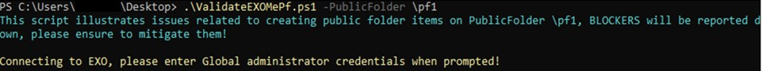
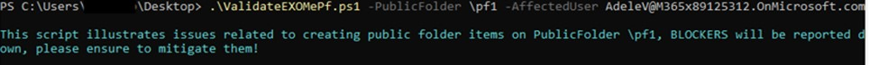
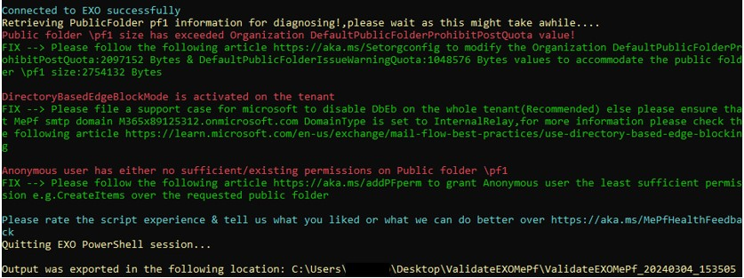
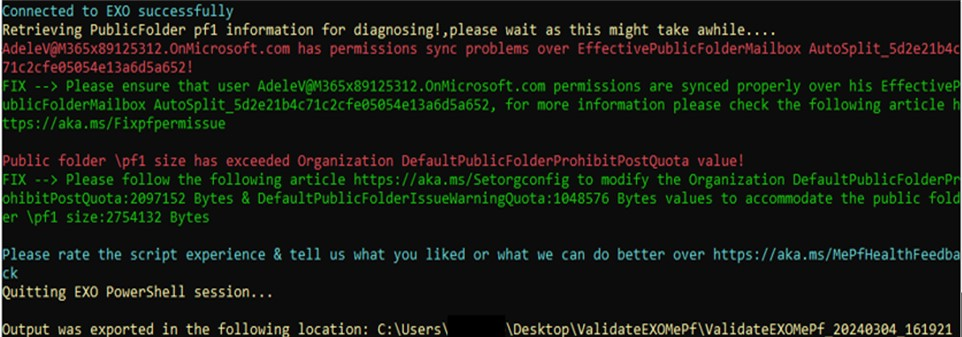

# ValidateEXOMePf

Download the latest release: [ValidateEXOMePf.ps1](https://github.com/hazemembaby/Scripts/Public Folders/ValidateEXOMePf/ValidateEXOMePf.ps1)

This script investigates public folders/items creation operations (aka. send mail) failures & propose FIXes for mitigation.
The script is working to validate the below conditions over the affected public folder

Checks run:
-----------
1.	Public folder size issue
    - Public folder content mailbox TotalItemSize value has exceeded its ProhibitSendReceiveQuota value
    - Public folder size is full
2.	Permissions issue
    - Permissions sync discrepancy between public folder mailboxes
    - Insufficient permissions
3.	Mail-enabled public folder health
    - Content mailbox is Active
    - MePf is not orphaned
    - MePf GUID
4.	Content Public folder mailbox across the public folder & its dumpster is different
5.	EntryId & DumpsterEntryID values are not mapped properly on the public folder & its dumpster
6.	Directory based edge blocking status
7.	Routing address “mail.onmicrosoft.com” existence in case of on-premises PFs
8.  Mail-enabled public folder health if MEPfProxyGuid was null

## Syntax

```powershell
ValidateEXOMePf.ps1
  [-PublicFolder <string[]>]
  [-AffectedUser <string[]>]
  [-ExportPath <string[]>]
```

## Output

The script will generate the public folder validation checks failures & proposed Fixes results on screen and will generate same results on ValidateMePfREPORT.txt file as well.
There are other files generated for either script logging purposes.

File Name|Content|Use
-|-|-
ValidateMePfREPORT.txt|Information about any blockers found|The script will display what it found, and in many cases it will provide a mitigation to fix the problem
ValidateMePfREPORTChecksLogging.csv|Information about the reason of script failure to run|The file will display errors encountered on running the script and at which stage

## Usage

Typically, the script should run with PublicFolder identity parameter as illustrated below:

```powershell
.\ValidateEXOMePf.ps1 -PublicFolder \pf1
```

The script will prompt for affected public folder identity/EntryID if it wasn't provided using PublicFolder parameter then it will prompt for global administrator username & password to connect to Exchange online PowerShell, by default it validates if the issue is specific to the Mail public folder "e.g. all users are affected"



If the issue happens only with a specific user on that case an affected user smtp address is required to be provided



In this example output, the script calls out three blockers.

It points out the below blockers:
   - Public folder size has exceeded Organization DefaultPublicFolderProhibitPostQuota value
   - DirectoryBasedEdgeBlockMode is activated on the tenant
   - Anonymous user has either no sufficient/existing permissions on Public folder



In this example output, the script calls out two blockers.

It points out the below issues:
   - User permissions sync problems over EffectivePublicFolderMailbox
   - Public folder size has exceeded Organization DefaultPublicFolderProhibitPostQuota value




